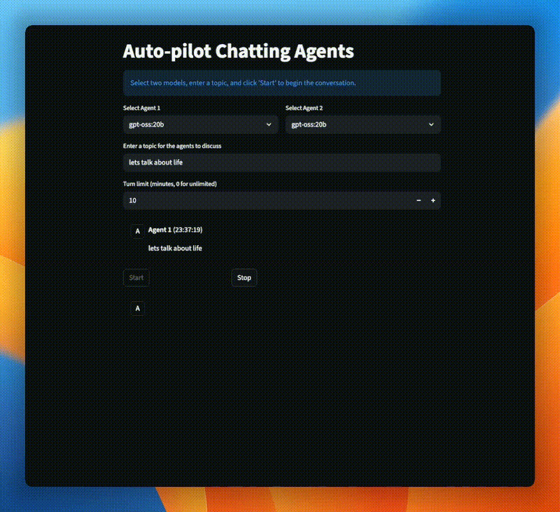

# Chatting Agents

A Streamlit application that facilitates autonomous conversations between two independently running Ollama language models, creating an automated agent-to-agent chat experience.




## Features

### Core Functionality
- **Model Selection**: Choose two different Ollama models to act as conversational agents
- **Conversation Control**: Start and stop conversations at any time with responsive controls
- **Real-time Streaming**: Watch the conversation unfold with live message streaming
- **Time Limits**: Set optional time limits for conversations (or run unlimited)
- **Topic-based Conversations**: Initiate conversations with specific topics

### Enhanced User Experience
- **Input Validation**: Prevents selecting the same model twice for more interesting conversations
- **Real-time Progress**: Live elapsed time display with limit tracking
- **Conversation Stats**: View message count and duration in the sidebar
- **Better Error Messages**: Clear, helpful error messages with recovery suggestions
- **Improved Layout**: Clean, intuitive interface with sidebar for export and stats

### Export & Documentation
- **Enhanced Export**: Save conversations as Markdown with complete metadata including:
  - Start and finish timestamps
  - Conversation duration
  - Model information
  - Time limit settings
  - All messages with timestamps


## Architecture

The application is now modular and well-organized:

```
chatting-agent/
├── app.py              # Main Streamlit application with UI components
├── config.py           # Configuration management (environment variables, defaults)
├── ollama_client.py    # Ollama API client with error handling
├── chat_manager.py     # Conversation state management and business logic
├── requirements.txt    # Python dependencies
└── README.md          # This file
```

### Key Components

- **`config.py`**: Centralized configuration with environment variable support
- **`ollama_client.py`**: Clean API wrapper with custom error handling
- **`chat_manager.py`**: Explicit conversation state management using dataclasses
- **`app.py`**: UI rendering and user interaction handling


## Installation

### Prerequisites
- Python 3.8 or higher
- [Ollama](https://ollama.ai/) installed and running locally

### Setup

1. Clone the repository:
   ```bash
   git clone <repository-url>
   cd chatting-agent
   ```

2. Install dependencies:
   ```bash
   pip install -r requirements.txt
   ```

3. Ensure Ollama is running:
   ```bash
   ollama serve
   ```

4. Pull some Ollama models (if you haven't already):
   ```bash
   ollama pull llama2
   ollama pull mistral
   ```


## Usage

### Basic Usage

Run the application:
```bash
streamlit run app.py
```

Then:
1. Select two different models for Agent 1 and Agent 2
2. Enter a topic for discussion
3. Optionally set a time limit (0 for unlimited)
4. Click "Start" to begin the conversation
5. Click "Stop" to end it at any time
6. Use "Save Chat" in the sidebar to export the conversation


### Configuration

The application can be configured using environment variables:

```bash
# Ollama host (default: http://localhost:11434)
export OLLAMA_HOST=http://localhost:11434

# Custom system prompt for agents
export SYSTEM_PROMPT="Your custom prompt here"

# Log file location (default: app.log)
export LOG_FILE=app.log

# Log level (default: INFO)
export LOG_LEVEL=DEBUG
```


## Improvements in This Version

### Code Quality
✅ **Modular Architecture**: Separated concerns into dedicated modules
✅ **Type Hints**: Comprehensive type annotations throughout
✅ **Better Error Handling**: Custom exceptions and graceful error recovery
✅ **Logging**: Improved logging with configurable levels
✅ **Documentation**: Docstrings for all functions and classes

### Usability
✅ **Input Validation**: Prevents invalid configurations (same model, empty topic)
✅ **Real-time Feedback**: Live elapsed time and progress indicators
✅ **Better UX**: Removed confusing disabled chat input
✅ **Conversation Stats**: Message count and duration tracking
✅ **Enhanced Export**: Complete metadata in exported conversations

### Maintainability
✅ **Explicit Turn Logic**: Clear agent switching instead of parity-based logic
✅ **Reduced Reruns**: Optimized Streamlit reruns for better performance
✅ **Configuration Management**: Environment variable support for flexibility
✅ **State Management**: Dataclass-based conversation state


## Development

### Project Structure

- **Configuration Layer** (`config.py`): Manages all configurable settings
- **API Layer** (`ollama_client.py`): Handles all Ollama API interactions
- **Business Logic Layer** (`chat_manager.py`): Manages conversation state and logic
- **Presentation Layer** (`app.py`): Renders UI and handles user interactions

### Running Tests

The application includes comprehensive error handling and validation. To test:

1. Start without Ollama running to see error handling
2. Try selecting the same model for both agents (validation should prevent it)
3. Test time limits with short durations
4. Test the export functionality


## Troubleshooting

**Ollama connection errors:**
- Ensure Ollama is running: `ollama serve`
- Check the Ollama host setting matches your setup
- Review logs in `app.log` for detailed error information

**Model not available:**
- Pull the required models: `ollama pull <model-name>`
- Use `ollama list` to see available models

**Application errors:**
- Check `app.log` for detailed error messages
- Ensure Python dependencies are installed: `pip install -r requirements.txt`


## License

This project is open source and available for use and modification.
